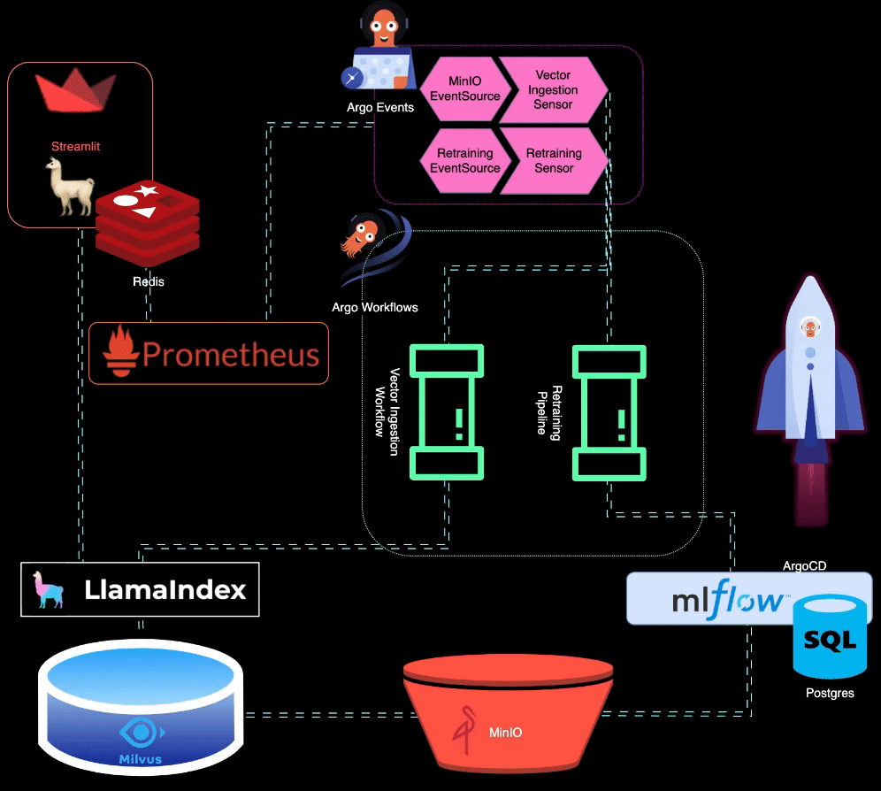

# BigBertha: A Kubernetes native LLMOps Architecture Design

BigBertha is an architecture design that demonstrates how automated LLMOps (Large Language Models Operations) can be achieved on any Kubernetes cluster using open source container-native technologies 🌟

## Architecture

## LLMOps Capabilities 🚀

### 1. LLM Monitoring

👀 BigBertha utilizes Prometheus to monitor LLM (Large Language Model) serving modules. For demo purposes, a Streamlit app is used to serve the LLM, and Prometheus scrapes metrics from it. Alerts are set up to detect performance degradation.

### 2. Auto-triggering LLM Retraining/Fine-tuning

⚙️ Prometheus triggers alerts when the model performance degrades. These alerts are managed by AlertManager, which uses Argo Events to trigger a retraining pipeline to fine-tune the model.

### 3. Training, Evaluating, and Logging the Retrained LLM

🏋️ The retraining pipeline is orchestrated using Argo Workflows. This pipeline can be tailored to perform LLM-specific retraining, fine-tuning, and metrics tracking. MLflow is used for logging the retrained LLM.

### 4. Triggering the Generation of New Vectors for Fresh Data

🔄 MinIO is used for unstructured data storage. Argo Events is set up to listen for upload events on MinIO, triggering a vector ingestion workflow when new data is uploaded.

### 5. Ingesting New Vectors into the Knowledge Base

🔍 Argo Workflows is used to run a vector ingestion pipeline that utilizes LlamaIndex for generating and ingesting vectors. These vectors are stored in Milvus, which serves as the knowledge base for retrieval-augmented generation.

## Stack Overview

BigBertha relies on several key components:

- **ArgoCD:** A Kubernetes-native continuous delivery tool that manages all components in the BigBertha stack.

- **Argo Workflows:** A Kubernetes-native workflow engine used for running vector ingestion and model retraining pipelines.

- **Argo Events:** A Kubernetes-native event-based dependency manager that connects various applications and components, triggering workflows based on events.

- **Prometheus + AlertManager:** Used for monitoring and alerting related to model performance.

- **LlamaIndex:** A framework for connecting LLMs and data sources, used for data ingestion and indexing.

- **Milvus:** A Kubernetes-native vector database for storing and querying vectors.

- **MinIO:** An open-source object storage system used for storing unstructured data.

- **MLflow:** An open-source platform for managing the machine learning lifecycle, including experiment tracking and model management.

- **Kubernetes:** The container orchestration platform that automates the deployment, scaling, and management of containerized applications.

- **Docker Containers:** Docker containers are used for packaging and running applications in a consistent and reproducible manner.

## Demo Chatbot

As a demonstration, BigBertha includes a Streamlit-based chatbot that serves a Llama2 7B quantized chatbot model. A simple Flask app is used to expose metrics, and Redis acts as an intermediary between Streamlit and Flask processes.

## License 📄

This project is open-source and is governed by the terms and conditions outlined in the [LICENSE](LICENSE) file included in this repository. 📜
