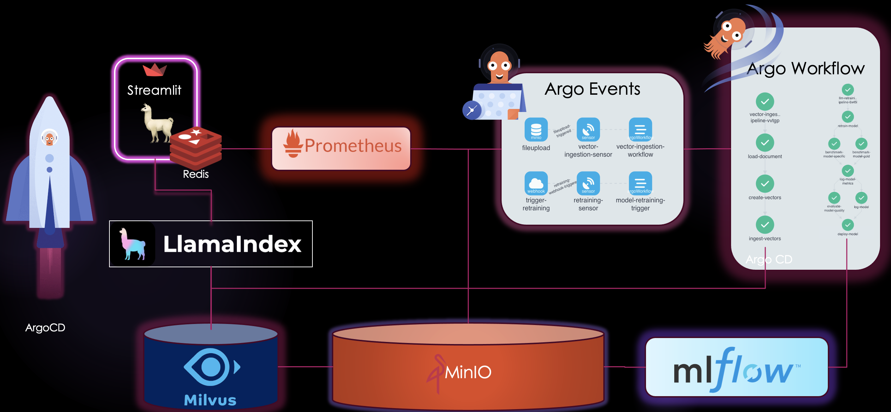

# BigBertha - 🐳 Kubernetes Native LLMOps Architecture 🚀

BigBertha is a Kubernetes-native LLMOps architecture, and it's packed with emojis to make your journey even more exciting! 🌟

## Architecture

## 🤖 Demo Chatbot
- For the demo chatbot, a StreamLit based app is used.
- LLama2 powers the core of the LLM.
- 📈 Since StreamLit does not provide a /metrics endpoint natively, model performance metrics are stored in Redis.
- A Flask app, 🌐 exposed via `/metrics`, makes the metrics scrape-able by Prometheus.
- The demo chatbot adopts the RAG methodology (Retrieval-Augmented Generation) for enhanced language processing.
- LLamaIndex comes into play for seamless querying of vectors from Milvus.
- The deployment leverages Kubernetes Deployment objects with a ClusterIP. 🐳

## 📡 LLM Performance Monitoring using Prometheus

- Prometheus is used for monitoring the LLM performance metrics.
- Correctly configured ServiceMonitors, PrometheusRules, and AlertManagerConfig CRDs make sure every metric is scraped and analyzed. 🧐

## ⚙️ Automated LLM Retraining and Fine-tuning

- Depending on alerting rules configured, the Alert Manager steps in.
- An Argo Events Webhook EventSource comes into play.
- This EventSource triggers a Sensor.
- The Sensor, in turn, kicks off an ArgoWorkflow.
- This workflow is a whirlwind, fine-tuning and retraining the LLM.
- Benchmarking happens, and performance results are logged to MLFlow.
- The model itself finds its place in MLFlow's hall of fame. 🏆

## 📥 Automated Vector Ingestion

- An Argo Events EventSource of type minio listens for MinIO events like file uploads.
- When a file lands in MinIO, an Argo Events Sensor swoops in.
- The Sensor triggers an ArgoWorkflow.
- This workflow loads the freshly ingested data, works its magic to convert it into vectors, and finally, 🚀 pushes these vectors to Milvus for efficient querying.

## 🗄️ Data Storage with MinIO

- MinIO takes on the role of a robust data storage layer, ensuring data reliability. 💾

## Technologies Used 🛠️

BigBertha integrates several technologies to create a powerful and versatile LLM deployment and operations architecture:

- **Kubernetes**: Container orchestration 🐋

- **ArgoCD**: ArgoCD is used for GitOps-based deployments and for managing the state of the components.

- **LLamaIndex**: Used for querying vectors from Milvus.

- **Milvus**: A vector database for efficient data retrieval.

- **Prometheus**: Employed for model monitoring with correctly configured ServiceMonitors, PrometheusRules, and AlertManagerConfig CRDs.

- **Argo Events**: Handles event-driven automation, including triggering workflows.

- **Argo Workflows**: Manages the orchestration of LLM fine-tuning, retraining, and vector ingestion.

- **MinIO**: Serves as the data storage layer for the architecture. 📦

## License 📄

This project is open-source and is governed by the terms and conditions outlined in the [LICENSE](LICENSE) file included in this repository. 📜